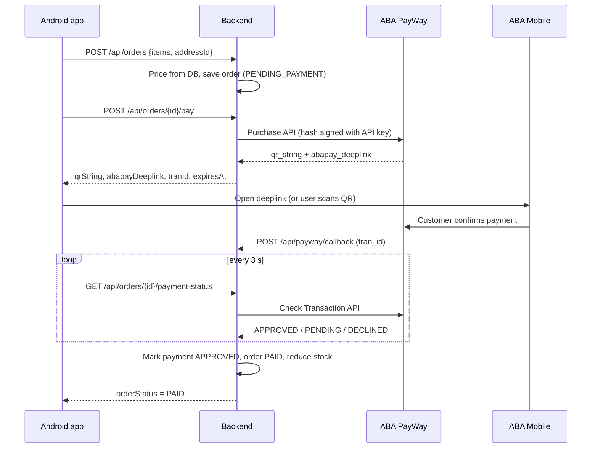
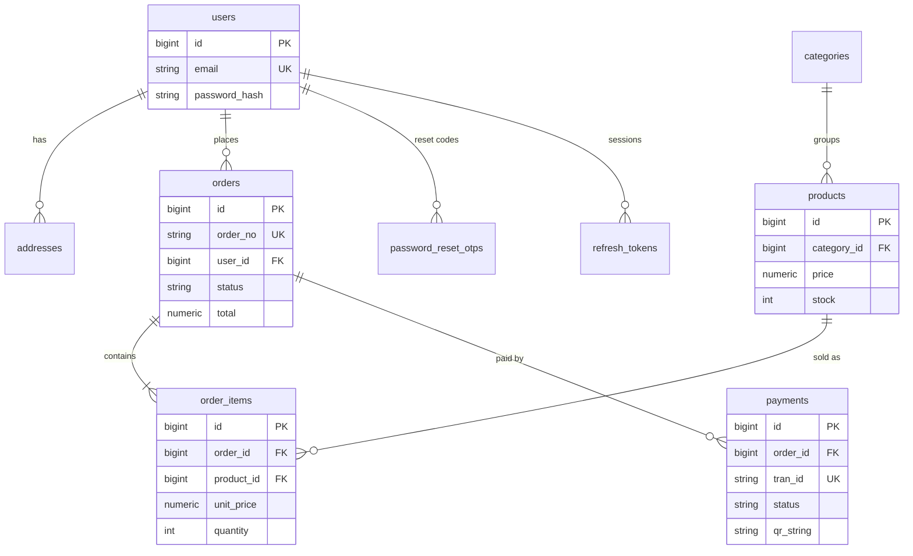

# VShop — Backend

Spring Boot (Kotlin) + PostgreSQL backend for a small e-commerce Android app that takes payments through the **ABA PayWay sandbox** (KHQR and ABA Pay deeplink).

## Tech stack

| Part | Choice |
|---|---|
| Language | Kotlin 1.9, Java 17+ |
| Framework | Spring Boot 3.3 (Web, Data JPA, Security, Validation) |
| Database | PostgreSQL 16, schema managed by Flyway |
| Auth | Short-lived access JWT (jjwt) + rotating refresh tokens, BCrypt passwords |
| Payments | ABA PayWay Purchase API (`abapay_khqr_deeplink`) + Check Transaction API |

## Run it

**Quick start: everything in Docker** (needs Docker Desktop, no Java needed)

```bash
docker compose up -d --build   # first time, or after code changes
docker compose up -d           # later
docker compose stop            # stop (data is kept)
```

The API is at http://localhost:8080 and the database at `localhost:5433`. A `.env` file is optional here. Logs: `docker logs -f vshop-api`.

To work on the code instead, follow the steps below.

**1. Start PostgreSQL only** (needs Docker Desktop)

```bash
docker compose up -d postgres
```

**2. Create your `.env`**

```bash
cp .env.example .env
```

Leave `PAYWAY_MOCK=true` for now. The app runs with a fake PayWay, so you can build the Android app without keys.

**3. Run the server**

```bash
./gradlew bootRun        # Windows: gradlew.bat bootRun
```

Open http://localhost:8080/api/products. You should see 14 sample products.
From the Android emulator, use `http://10.0.2.2:8080`.

**4. Run the tests** (no database needed)

```bash
./gradlew test
```

## Switch to the real PayWay sandbox

1. In `.env` set `PAYWAY_MOCK=false` and paste your sandbox **Public Key** into `PAYWAY_API_KEY`.
2. (Optional) Let PayWay call you back:
   ```bash
   ngrok http 8080
   ```
   Put `https://<your-id>.ngrok-free.app/api/payway/callback` in `PAYWAY_CALLBACK_URL`.
   Without this, payments still work: the status endpoint asks PayWay directly on every poll.
3. Restart the server.

## How a payment works



**Rules the code follows**

- **Price comes from the database.** The app only sends product IDs and quantities.
- **The callback is only a signal.** Status is always confirmed with PayWay's Check Transaction API, so a fake callback can't mark an order paid.
- **No double processing.** The payment row is locked (`SELECT ... FOR UPDATE`) while it's updated, and a final status is never changed again.
- **Amount check.** If PayWay reports a different amount than the order total, the payment is marked `FAILED` and logged.
- **One QR at a time.** Calling `/pay` again returns the same QR until it expires.
- **Secrets stay on the server.** The Android app never sees the API key.

## Database



Order items copy the product name and price at the time of purchase, and orders copy the address. Later price or address changes don't rewrite old orders.

**Status values**

| Order | Payment |
|---|---|
| `PENDING_PAYMENT` → `PAID` → `SHIPPING` → `DELIVERED`, or `CANCELLED` | `PENDING` → `APPROVED` / `DECLINED` / `CANCELLED` / `EXPIRED` / `FAILED` |

## API

Public: auth (except `/api/auth/me`), categories, products. Everything else needs `Authorization: Bearer <accessToken>`.

| Method | Path | What it does |
|---|---|---|
| POST | `/api/auth/register` | Create account (no login) |
| POST | `/api/auth/login` | Returns access + refresh token |
| POST | `/api/auth/refresh` | Swaps a refresh token for a new pair |
| POST | `/api/auth/logout` | Revokes a refresh token |
| POST | `/api/auth/password-reset/request` | Sends a 6-digit code (always answers the same) |
| POST | `/api/auth/password-reset/verify` | Checks the code (doesn't use it up) |
| POST | `/api/auth/password-reset/confirm` | Sets the new password with email + code |
| GET | `/api/auth/me` | Who am I (`id`, `email`) |
| GET / PUT | `/api/me` | Profile: `fullName`, `phone` (sent to PayWay at checkout) |
| GET | `/api/categories` | All categories |
| GET | `/api/products?categoryId=&q=&sort=newest\|price_asc\|price_desc&page=&size=` | Paged products |
| GET | `/api/products/{id}` | Product detail |
| GET / POST | `/api/addresses` | List / add address |
| PUT / DELETE | `/api/addresses/{id}` | Edit / delete address |
| POST | `/api/orders` | Create order from cart |
| GET | `/api/orders?status=` | My orders |
| GET | `/api/orders/{id}` | Order detail |
| POST | `/api/orders/{id}/cancel` | Cancel unpaid order |
| POST | `/api/orders/{id}/pay` | Get KHQR + ABA Pay deeplink |
| GET | `/api/orders/{id}/payment-status` | Poll payment result |
| POST | `/api/payway/callback` | Called by PayWay |
| POST | `/api/dev/payments/{tranId}/approve` | Mock mode only: fake a payment |

Ready-made requests are in `api-requests.http`.

Errors always look like this (`fieldErrors` only appears on validation errors):

```json
{ "status": 400, "error": "Bad Request", "message": "Validation failed",
  "path": "/api/auth/register", "timestamp": "2026-09-30T08:15:30.123Z",
  "fieldErrors": { "password": "Password must contain at least one letter and one number" } }
```

## Auth

```
register ──▶ login ──▶ accessToken (15 min) + refreshToken (30 days)
                         │
   API call ── 401 ──▶ POST /refresh {refreshToken} ──▶ new pair (old refresh token revoked) ──▶ retry
```

| Endpoint | Body | Success | Errors |
|---|---|---|---|
| `POST /api/auth/register` | `{ "email", "password" }` | **201** `{ "id": "1", "email" }` | 400 validation, 409 email taken |
| `POST /api/auth/login` | `{ "email", "password" }` | 200 tokens (below) | 401 `Invalid email or password` |
| `POST /api/auth/refresh` | `{ "refreshToken" }` | 200 tokens | 401 invalid / expired / revoked |
| `POST /api/auth/logout` | `{ "refreshToken" }` | 200 `{ "message": "Logged out" }` (also for unknown tokens) | 400 validation |
| `POST /api/auth/password-reset/request` | `{ "email" }` | 200 `{ "message": "If that email is registered, a reset code has been sent" }` | 429 too many requests |
| `POST /api/auth/password-reset/verify` | `{ "email", "otp" }` | 200 `{ "message": "Code verified" }` | 400 `Invalid or expired OTP` / `Too many incorrect attempts. Please request a new code` |
| `POST /api/auth/password-reset/confirm` | `{ "email", "otp", "newPassword" }` | 200 `{ "message": "Password has been reset successfully" }` | same 400s as verify |
| `GET /api/auth/me` | Bearer access token | 200 `{ "id": "1", "email" }` | 401 |

Tokens response:

```json
{ "accessToken": "eyJ...", "refreshToken": "86 base64url chars", "tokenType": "Bearer", "expiresInSeconds": 900 }
```

- **Passwords:** 8–72 characters with at least one letter and one number (BCrypt).
- **ids are strings** in auth responses (`"1"`), even though the database uses numbers.
- **Access token:** JWT signed with `JWT_SECRET`, lifetime `JWT_ACCESS_EXPIRY_MIN` (default 15). A missing, invalid or expired token on a protected endpoint returns **401** `Authentication required`, which is the app's signal to refresh.
- **Refresh token:** 64 random bytes (base64url). Only its SHA-256 hash is stored in `refresh_tokens`. Lifetime `JWT_REFRESH_EXPIRY_DAYS` (default 30). Every `/refresh` revokes the old token, so always save the new pair. Expired rows are deleted every night at 03:00.
- **Register doesn't log in** and doesn't take a name. The name is set to the part of the email before `@`; change it with `PUT /api/me`.

### Password reset

```
request {email} ──▶ 6-digit code (email or server log) ──▶ verify {email, otp} ──▶ confirm {email, otp, newPassword}
```

- **Test without email:** keep `OTP_LOG_ONLY=true`. The code is printed in the server log as `[DEV ONLY] Password reset code for ...`.
- **Real email:** set `OTP_LOG_ONLY=false` and fill `MAIL_*` in `.env` (a free Mailtrap testing inbox works).
- **Safety rules in the code:**
  - Only the BCrypt hash of the code is stored, never the code.
  - Codes expire after `OTP_EXPIRY_MIN` (10) minutes and lock after `OTP_MAX_ATTEMPTS` (5) wrong tries.
  - At most `OTP_MAX_REQUESTS_PER_HOUR` (5) codes per email per hour, then **429**. Asking again makes the old code stop working.
  - `request` answers the same for unknown emails, so nobody can check who has an account.
  - `verify` only checks the code; `confirm` checks it again, changes the password, uses up the code and logs the user out on every device (all refresh tokens revoked).
- **Tables:** `password_reset_otps` (Flyway `V3`), `refresh_tokens` (Flyway `V4`).

## Notes for the Android app

- **Cart and wishlist live on the phone** (Room or DataStore). The server only sees the cart when you create the order.
- **Show the QR:** render `qrString` with ZXing (`com.google.zxing:core`) into a Bitmap.
- **Open ABA Mobile:** `startActivity(Intent(Intent.ACTION_VIEW, Uri.parse(abapayDeeplink)))`, and catch `ActivityNotFoundException` to fall back to the QR.
- **Polling:** call `payment-status` every 3 seconds while the payment screen is visible, and once more in `onResume` when the user comes back from ABA Mobile. Stop when `orderStatus` is `PAID` or `paymentStatus` is `EXPIRED` / `DECLINED` / `CANCELLED`.
- **Cleartext HTTP:** for `http://10.0.2.2` add a `network_security_config` that allows cleartext for that host in debug builds.

## Project layout

Same layered structure as the TodoList backend: a request goes **controller → service → repository → entity**, with DTOs at the edge.

```
src/main/kotlin/com/vshop/
├── VShopApplication.kt
├── config/       AppProperties (JWT, shop, OTP, PayWay), SecurityConfig (public vs protected URLs, 401 JSON)
├── controller/   HTTP only: read the request, call a service, return a DTO
│                 AuthController, MeController, CatalogController, AddressController,
│                 OrderController, PayWayCallbackController, DevPaymentController
├── dto/          request/response classes + entity → response mappers
│                 AuthDtos, CatalogDtos, AddressDtos, OrderDtos, PaymentDtos, ErrorResponse, PageResponse
├── entity/       JPA tables: User, RefreshToken, PasswordResetOtp, Category, Product, Address,
│                 Order (ShopOrder, OrderItem, OrderStatus), Payment (Payment, PaymentStatus)
├── exception/    ApiException + notFound()/badRequest()/conflict()/unauthorized()/tooManyRequests(),
│                 InvalidOtpException, GlobalExceptionHandler (one JSON error shape)
├── repository/   one Spring Data interface per entity (UserRepository, ProductRepository, …)
├── security/     JwtService, JwtAuthFilter, AuthUser (the logged-in user), SecureTokens (random tokens, SHA-256)
├── service/      business rules + @Transactional
│                 AuthService, OtpSender, RefreshTokenCleanup, CatalogService, AddressService,
│                 OrderService, PaymentService
└── payway/       PayWay client (real + mock), HMAC hasher
src/main/resources/db/migration/   Flyway SQL (schema + sample data)
```

- **Controllers never touch repositories.** They only call services, so all rules (stock check, ownership, payment status) sit in one place.
- **Entities never leave the server.** Services return DTOs from `dto/`, so changing a table doesn't change the JSON the app sees.

## Troubleshooting

| Problem | Fix |
|---|---|
| `Wrong hash` from PayWay | Check `PAYWAY_API_KEY` has no spaces and is the sandbox Public Key. Field order is in `PayWayHasher.PURCHASE_HASH_ORDER`. |
| PayWay rejects the request from your IP or domain | Ask ABA to whitelist your sandbox domain or IP. |
| `Connection refused` to PostgreSQL | Run `docker compose up -d` and check port 5433 is free. |
| Emulator can't reach the server | Use `http://10.0.2.2:8080`, not `localhost`. |
| Callback never arrives | Normal on localhost. Use ngrok, or rely on polling. |
| Key expired | The sandbox key has an expiry date. Ask ABA for a new one. |

## Next steps

- Admin endpoints to add products and move orders to `SHIPPING` / `DELIVERED`
- Scheduled job to expire old pending payments
- Integration tests with Testcontainers
